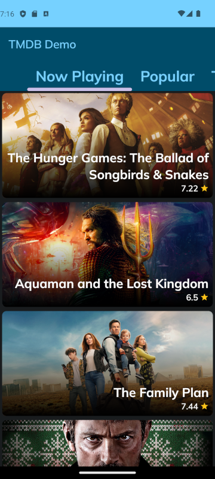

# TMDB Demo
Sample Android application which uses [TMDB's API](https://developer.themoviedb.org/docs).

It provides some movie categories where the user can found a list of movies: 

- Now Playing
- Popular
- Top Rated
- Upcoming

When the user clicks on a movie, the details related to it are displayed, like plot summary, genres, year of release, user rating according to TMDB, popularity and casting members.

The aim of this project is to demonstrate the use of Clean Architecture alongside with MVVM. The user interface was made using [Jetpack Compose](https://developer.android.com/jetpack/compose) and the whole code was written in [Kotlin](https://kotlinlang.org/).

## Light and dark themes

The application has both light and dark themes:
 

### Light theme
 

|| | |

### Dark theme
 

|| | |

## I18N

The application also supports Brazilian Portuguese as language, according to the system settings. Calls to TMDB's API are done using these settings:

 

|| | |

## Resources

### Layout

The application layout was based on this [Figma prototype](https://dribbble.com/shots/10795979-Movie-App-Free) made by [Simantoo](mailto:simantoo@gmail.com).

### Application Icon

The application icon was made on [IconKitchen](https://icon.kitchen/).

### Color Palette

The color palette was chosen using [Accessible Palette](https://accessiblepalette.com/).

### Font

The font used on application is [Mulish](https://fonts.google.com/specimen/Mulish) from Google Fonts.

## TODOs

- Add age rating to the movie details
- Tests
- Configure build system
